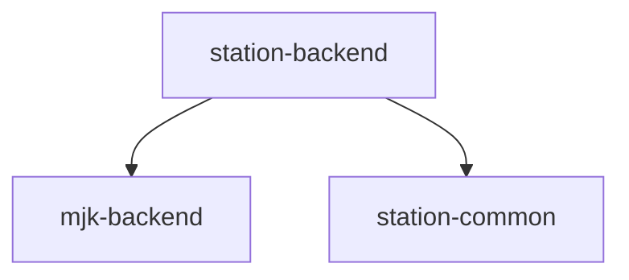

# Station Backend
Python/Flask backend for Eyelib Station.

## Local Dependencies

```mermaid
   graph TD;
   station-backend --> mjk-backend;
   station-backend --> station-common;

```

# To get this to work on local machines you need to install Twincat 3 - Request location from senior dev
